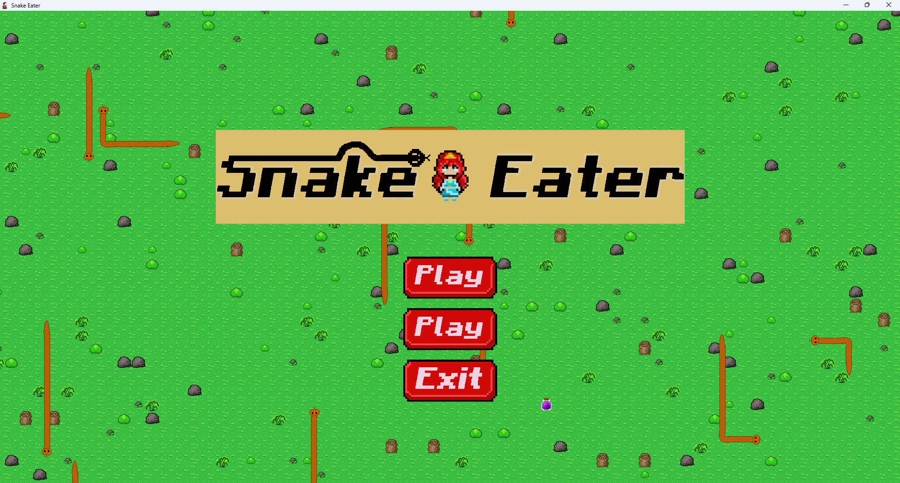
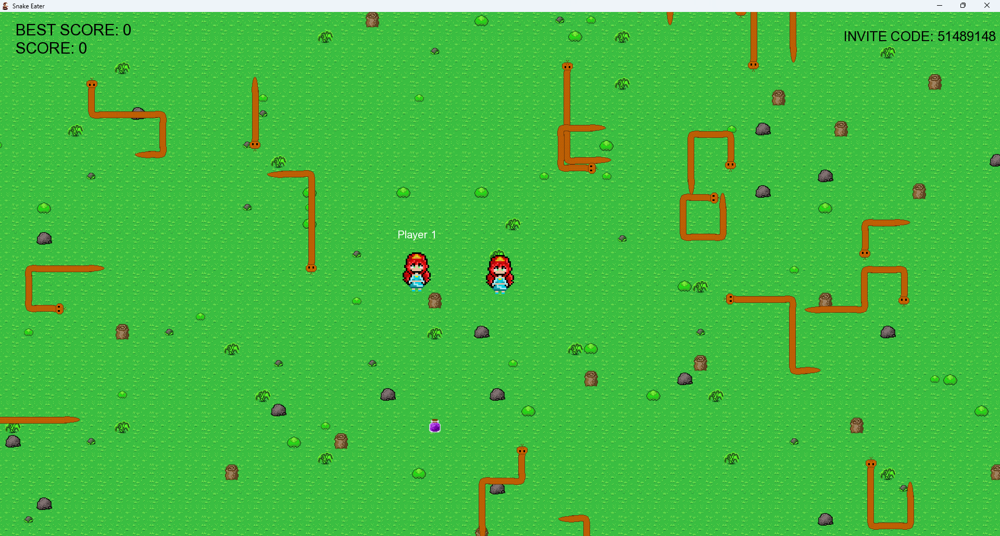

# 🐍 Snake Eater

Snake Eater is a 2D arcade game where players hunt and eat snakes while trying to survive their attacks. Snakes can bite the player and inflict poison damage, making antidotes essential for survival.

In addition to single-player gameplay, the game supports online co-op multiplayer through a dedicated Java server. The client is written in C++ using WinSock for networking.

## Features

* Unique snake-hunting gameplay
* AI-controlled snakes
* Poison and antidote mechanics
* Score system
* Online co-op multiplayer
* Dedicated multiplayer server
* Real-time network synchronization

## Controls

* **W A S D** or **Arrow Keys** — Move
* **Space** or **Left Mouse Button** — Eat a snake

## Technologies Used

* C++
* SFML
* WinSock
* Java (multiplayer server)

## Multiplayer

The game supports online cooperative play through a dedicated Java server.

The server source code is available in a separate repository:

* Server Repository: https://github.com/JohnnyRock2023/Snake_Eater_Server

## Screenshots

## Gameplay
  
[Link](Videos/Video.mp4)

## Project Status

✅ Completed

## Authors  
  
GAME DIRECTOR  
ROMAN KUTSENKO

GAME DESIGNER  
ROMAN KUTSENKO  

LEAD PROGRAMMER  
ROMAN KUTSENKO

GAMEPLAY PROGRAMMER  
ROMAN KUTSENKO

NETWORK PROGRAMMER  
ROMAN KUTSENKO

AI PROGRAMMER  
ROMAN KUTSENKO

UI DESIGNER  
VIKTORIA PAVLENKO

LEAD ARTIST  
VALERIA TEMCHUR

SOUND DESIGNER  
ZLATA ZADUMINA

QA TESTERS  
ROMAN KUTSENKO  
VIKTORIA KOSHMAN
